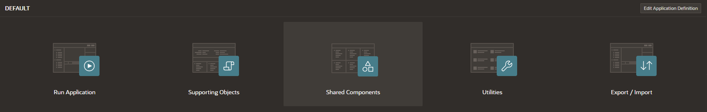
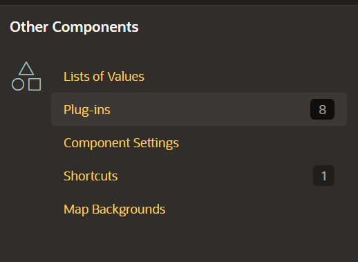
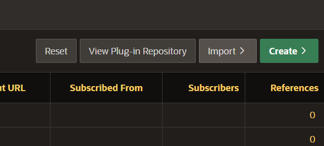
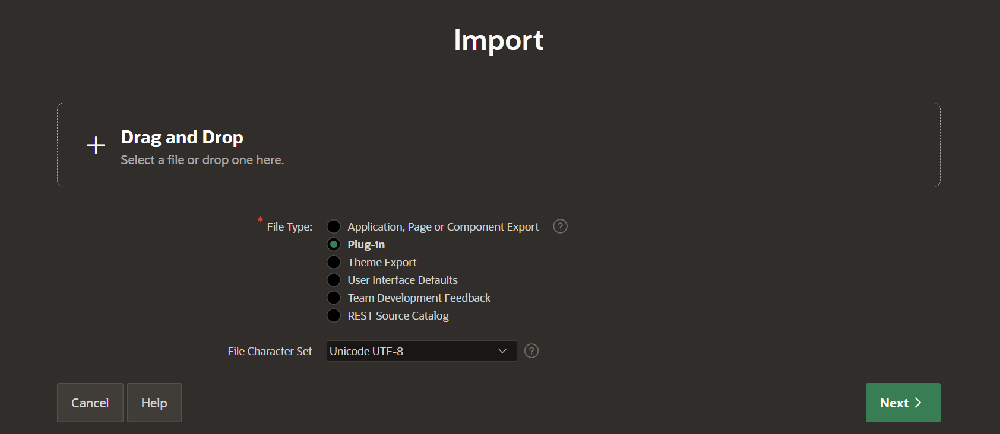
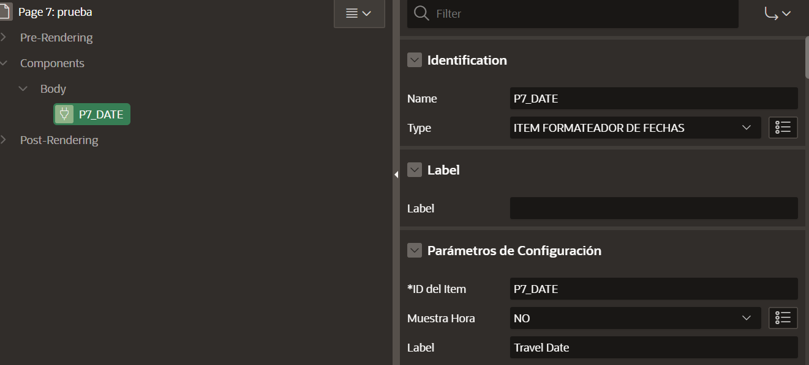

  

 

# Oracle APEX Date Formatter Plugin

## Description

This plugin for Oracle APEX automatically formats both dates and date-times. It supports the following input formats:

- `ddmmyyyy hh:mm`
- `d/m/yy`
- `d/m/yy hh:mm`
- `ddmmyyyy hhmm`
- `ddmmyy hhmm`
- `d/m/yy hhmm`
- `dmyy`
- `ddmmyy`
- `ddmmyyyy`

It provides the formatted output based on the "Show Time" setting:

- **Show Time: YES** => `dd/mm/yyyy hh:mm`
- **Show Time: NO** => `dd/mm/yyyy`

## Usage

To use this plugin in your Oracle APEX application, follow these steps:

1. **Download and Import**: Download the plugin file (SQL File) and upload it to your Oracle APEX application.

   - 
   - 
   - 
   - 

2. **Configuration**: Configure the following attributes on the item where you want to apply the formatting:

   - 
   - 
   - 
   - 
